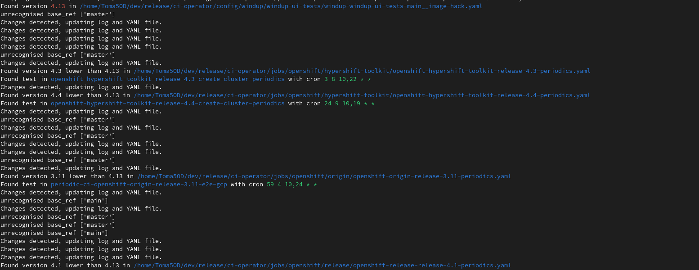
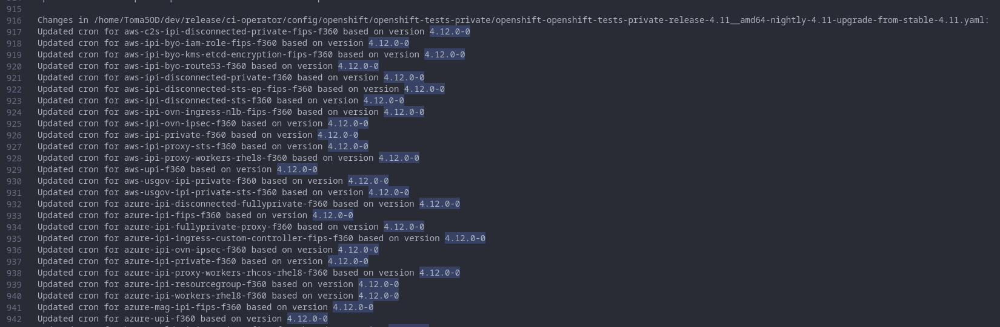

# Code Update Summary

## Overview
This document outlines the significant changes made to the codebase for aligning with the specified JIRA ticket.

[JIRA Ticket](https://issues.redhat.com/browse/DPTP-3645)

---

## Changes

### Logging
- Replaced print statements with logging with both verbose and non-verbose modes. Non-verbose commented out for the moment.

### Version Targeting
- Added a `TARGET_VERSION` constant to focus on versions equal to or below 4.13.

### Specific Version and Job Exclusions
- Excluded version 4.12 and jobs starting with `promote-` and `mirror-nightly-image`.

### Modularization
- Broke down the `replace` function into smaller, task-focused functions:
    - `process_interval`
    - `process_cron`
    - `process_promote`

### Change Logging
- Added a function `log_changes_to_txt` that logs changes made to YAML files.
- Can be easily removed.
### Cron Schedules
- For version 4.13: 
    - The cron is set to run weekly.
    - The day is randomly chosen to be either Saturday or Sunday.
    - The time is also randomized.

- For versions older than 4.12:
    - The cron is set to run bi-weekly.
    - The day of the first occurrence is randomly chosen between 5th and 10th of the month.
    - The day of the second occurrence is randomly chosen between 15th and 25th of the month.
    - The time is randomized between 1:00 and 10:00.
---

## How to Use
1. Make sure to specify the `TARGET_VERSION`.
2. Run the script with the YAML file as an argument.

### Command to Run

```find your_file_location/ci-operator/config/ your_file_location/ci-operator/jobs/ -name "*.yaml" -exec python your_script_location/main.py {} \; ```

Check the [changes_log.txt](./changes_log.txt) for a detailed list of changes made.


---
## Possible Issues

### Unrecognized base_ref ['master']
- If you encounter this issue, it suggests that the `base_ref` is not in the expected format.
- This was in the original script and it was dealt with in a similar way. I just don't fully understand it.


### 4.12.0-0
- This is probably fine but I'm not confident and I would like help understanding if this differs from 4.12 completely as it is a 4.11 file or if it is something to be concerned about.
- The code currently does not carry out changes on anything with 4.12.0-0 but this can easily be resoleved.


For all issues, it's recommended to discuss them in a 1-1 setting for better clarity and resolution.